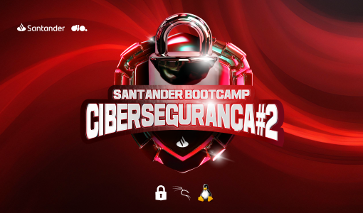
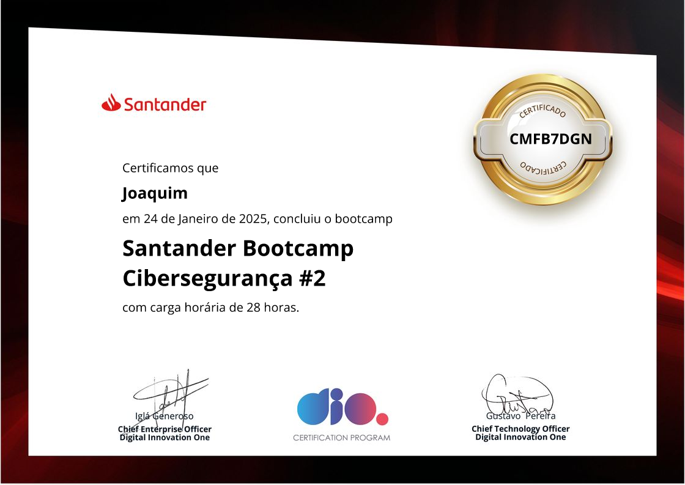

# 🔐 Santander Bootcamp Cibersegurança #2

Este repositório contém materiais e anotações do Santander Bootcamp Cibersegurança #2, um programa que aborda os principais conceitos e práticas da segurança cibernética.

## ➡️ Sobre o Bootcamp

O bootcamp oferece uma formação em cibersegurança, capacitando os participantes a identificar, prevenir e mitigar ameaças digitais. Os conteúdos incluem desde os fundamentos da segurança da informação até técnicas avançadas de testes de invasão (Pentest) e exploração de vulnerabilidades.

### 📚 Conteúdos abordados

✅ Fundamentos de Cibersegurança.
✅ Testes de invasão e busca por vulnerabilidades.
✅ Exploração de vulnerabilidades e ataques.
✅ Uso de ferramentas como Kali Linux e Python para segurança cibernética.

Com foco prático, o bootcamp inclui desafios de código, projetos e estudos de casos para aplicar os conceitos aprendidos.

### 🏆 Desafios do Bootcamp  

📌 [Desafio 1 - Criação de um Phishing com o Kali Linux.](phishing-kali-linux/README.md)  

📌 [Desafio 2 - Entendendo um ransomware na prática com python.](ransomware-python/README.md)  

## 🎓 Certificado  

