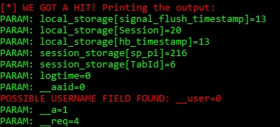

# 🏆 Desafio 1 - Criação de um Phishing com o Kali Linux.

## 🔐 3 Phishing para captura de senhas do Facebook

Neste desafio de projeto, iremos criar um Phishing para capturar senhas de login do Facebook. Segurança da Informação

### 🛠️ Ferramentas

- Kali Linux
- setoolkit

### ⚙️ Configurando o Phishing no Kali Linux

- Acesso root: ``sudo su``
- Iniciando o setoolkit: ``setoolkit``
- Tipo de ataque: ``Social-Engineering Attacks``
- Vetor de ataque: ``Web Site Attack Vectors``
- Método de ataque: ``Credential Harvester Attack Method ``
- Método de ataque: ``Site Cloner``
- Obtendo o endereço da máquina: ``ifconfig``
- URL para clone: http://www.facebook.com

### ✅ Resutado

